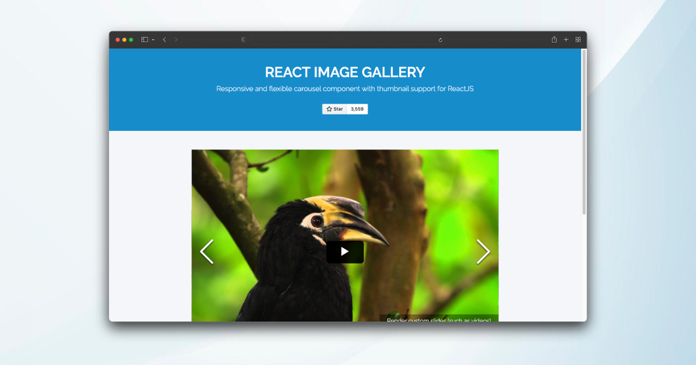
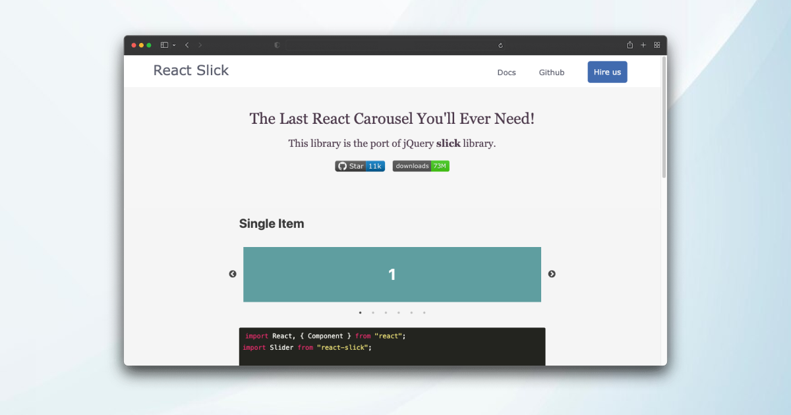
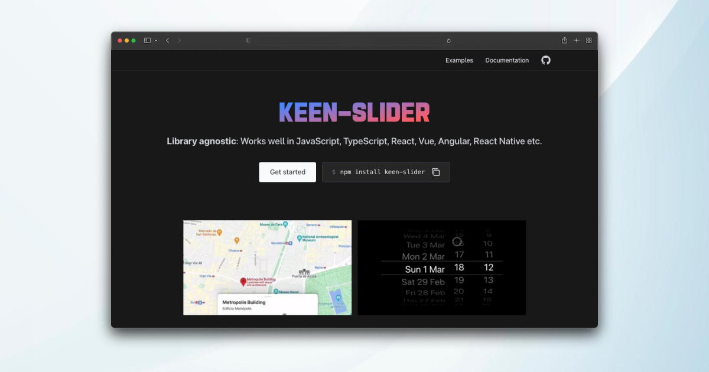
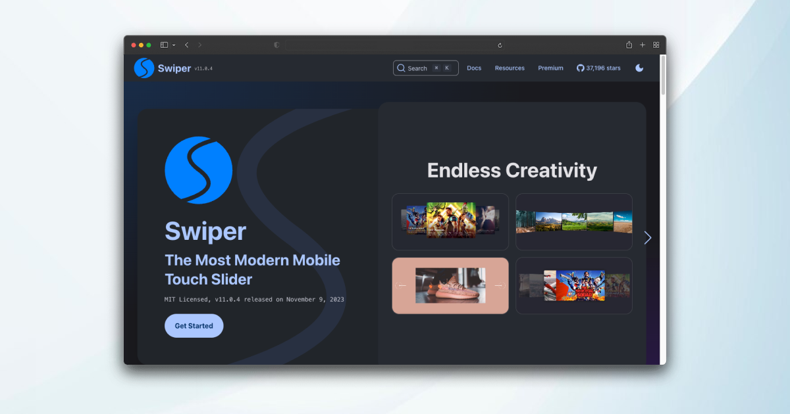
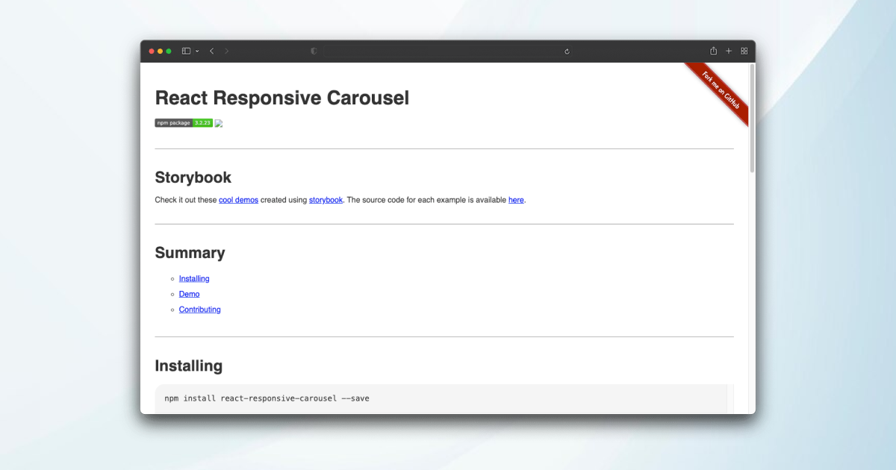
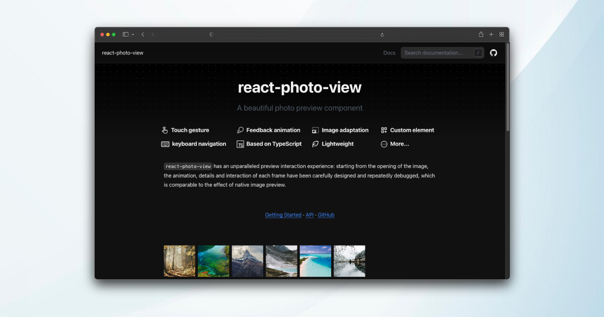

Photo galleries play a crucial role in displaying images in a structured and engaging way, which is essential whether you're showcasing a portfolio, product images, or any other visual content.

Given the popularity of React in front end development, picking the right photo gallery library is vital for not just the look and feel, but also for enhancing user interaction and engagement

In this concise guide, we present the top 7 React image gallery components, each meticulously handpicked and manually verified for quality and performance. We not only highlight their features but also discuss the pros and cons of each, ensuring you have all the information needed to make an informed choice for your projects.

### React image Gallery

<figure class="blog-images" data-src="react-image-gallery.png" data-lg-size="1200-630">
    
</figure>

<a href="https://linxtion.com/demo/react-image-gallery/" rel="nofollow">React image Gallery</a> is a versatile and user-friendly image gallery component for React applications, providing a seamless way to showcase and navigate through a collection of images. Leveraging the customizable options and responsive design, developers can easily create visually appealing galleries with features like thumbnails, captions, and lightbox functionality. React Image Gallery simplifies the process of integrating immersive image displays, making it a popular choice for building interactive and aesthetically pleasing galleries in React projects.

**Pros**

- Ease of Use: A user-friendly interface and straightforward setup contribute to an easier development process.

- It is responsive and works well on all devices.

- Performance Optimization: Well-optimized for performance, ensuring smooth interactions and fast loading times.

- It has a wide range of features, including support for mobile swipe gestures, thumbnail navigation, fullscreen support, custom rendered slides, RTL support, and tons of customization options.

**Cons**

- Styling Challenges: While customizable, developers might encounter challenges in styling the gallery to match complex design requirements.

- Performance with Many Images: Performance might be affected when dealing with a large number of high-resolution images. Lazy loading and optimization techniques may be necessary.

- Limited Default Styles: The image gallery might require additional styling to achieve a specific look and feel, depending on design preferences.

- Transition Animations: The transition animations might be considered basic compared to more feature-rich gallery libraries. Advanced animation requirements may need additional customization.

### React Slick

<figure class="blog-images" data-src="react-slick.png" data-lg-size="1200-630">
    
</figure>

<a href="https://react-slick.neostack.com/" rel="nofollow">React Slick</a> is a popular and feature-rich carousel component for React applications, built on top of the Slick carousel library. It offers a smooth and customizable solution for creating responsive image sliders with various transition effects. With a user-friendly API and extensive configuration options, React Slick is widely used for implementing dynamic and engaging carousels in React projects.

**Pros**

- Customizable: React Slick is highly customizable. It offers a wide range of settings and options for customizing the appearance and behavior of the carousel.

- Rich Feature Set: It comes with a variety of features such as lazy loading, infinite looping, autoplay, and more, giving developers flexibility in implementing different carousel behaviors.

- Support for Touch Events: React Slick supports touch events, making it suitable for mobile and touch-enabled devices.

- CSS Transitions: It uses CSS transitions for smooth animations, providing a polished and visually appealing carousel experience.

**Cons**

- Limited Default Styles: While it's customizable, some developers might find that React Slick requires additional styling to achieve a specific look and feel. This could be seen as a downside if you're looking for a carousel component with more built-in styles.

- For beginners, there might be a learning curve associated with understanding and configuring the various settings and options provided by React Slick.

- Potential for Large Bundle Size: Depending on your project configuration, using React Slick might contribute to a larger bundle size. This could be a concern for performance-conscious developers, especially for smaller projects.

- Possible Performance Issues: While React Slick aims to provide smooth animations, complex carousels with many elements might lead to performance issues. Developers should optimize the number of elements and images to ensure a good user experience.

### PhotoSwipe

<figure class="blog-images" data-src="photoswipe.png" data-lg-size="1200-630">
    
</figure>

<a href="https://photoswipe.com/react-image-gallery/" rel="nofollow">PhotoSwipe</a> for React is a React wrapper around the popular PhotoSwipe library, offering an elegant and responsive solution for image galleries and lightboxes. With a focus on simplicity and ease of use, it enables developers to integrate a feature-rich image viewer seamlessly into React applications. PhotoSwipe for React provides smooth gestures, zooming capabilities, and a clean UI, making it an excellent choice for creating visually appealing and user-friendly image galleries in React projects.

**Pros**

- Responsive - works with any screen size

- Faster loading time for web pages

- It provides smooth touch interactions and supports gestures, making it ideal for mobile users who can swipe through images or pinch to zoom.

- It offers a range of customization options, allowing you to adapt the appearance and behavior of the image gallery to fit your specific needs.

**Cons**

- Complex structure and difficult implementation

- Limited features. No Videos, Iframe, or thumbnails support

- If your project requires a highly customized and complex user interface for image galleries, you might find that PhotoSwipe has limitation

### Keen Slider

<figure class="blog-images" data-src="keen-slider.png" data-lg-size="1200-630">
    
</figure>

<a href="https://keen-slider.io/" rel="nofollow">Keen Slider</a> is a lightweight and customizable slider library for creating smooth and modern carousel components in React. Known for its simplicity and performance, Keen Slider allows developers to effortlessly implement responsive and touch-friendly sliders with minimal effort. With a focus on flexibility, Keen Slider supports various configurations, making it a user-friendly choice for crafting dynamic and interactive content displays in React applications.

**Pros**

- It has no dependencies and is very lightweight (~5.5KB gzipped).

- Continuous Looping: Offers the option for continuous looping, creating a seamless experience when navigating through slides.

- It supports multi-touch, vertical scrolling, fading effect, free mode, loop mode, and more.

- It has a rich but simple API and clear documentation with examples.

**Cons**

- Some developers might find a learning curve associated with understanding and configuring the various settings and options provided by Keen Slider.

- Not as well-documented as some other libraries: Keen Slider is not as well-documented as some of the other slider libraries available. However, the documentation that is available is clear and easy to follow.

- Limited Features: Depending on your project requirements, Keen Slider might lack certain advanced features compared to other slider solutions.

- Styling Challenges: While customizable, developers might encounter challenges in styling the slider to match complex design requirements.

### Swiper

<figure class="blog-images" data-src="swiper.png" data-lg-size="1200-630">
    
</figure>

<a href="https://swiperjs.com/" rel="nofollow">Swiper</a> is a powerful and touch-friendly carousel component built for React applications, providing a seamless way to create stunning and responsive slideshows. Leveraging the Swiper library, it offers a range of features like smooth transitions, navigation controls, and pagination, enhancing the user experience for dynamic content displays. Swiper flexibility and customization options make it a popular choice for implementing versatile and engaging sliders in React projects.

**Pros**

- Rich Feature Set: Swiper comes with a comprehensive set of features, including slides, navigation controls, pagination, scrollbar, parallax effects, lazy loading, and more. This makes it versatile for implementing various types of sliders and carousels.

- Modern and Lightweight: Swiper is designed with a modern architecture and is relatively lightweight, contributing to better performance. It's built with a modular structure, allowing developers to include only the components they need.

- CSS Transitions and Hardware Acceleration: Swiper utilizes CSS transitions and hardware acceleration for smooth and efficient animations, enhancing the overall user experience.

- Flexibility and Customization: Swiper offers a high level of customization, allowing developers to tailor the appearance and behavior of the slider to meet specific project requirements.

- Well-Documented: Swiper has thorough documentation with examples, making it easier for developers to understand and implement its features. This can be beneficial for both beginners and experienced developers.

**Cons**

- Complexity for Simple Use Cases: For simple use cases, Swiper might be seen as overkill due to its extensive feature set. If you only need basic functionality, there are simpler alternatives available.

- Bundle Size:  Depending on the features you include in your project, Swiper's bundle size can be relatively large. This might be a concern for developers prioritizing minimalism and optimizing page load times.

- Not Native Feel: Some developers might find that Swiper doesn't provide the exact native feel they desire, especially if they have specific UI/UX expectations.

- Bundle Size: Depending on the features you include in your project, Swiper's bundle size can be relatively large. This may be a concern for projects aiming for minimal page load times.

### React Responsive Carousel

<figure class="blog-images" data-src="react-responsive-carousel.png" data-lg-size="1200-630">
    
</figure>

<a href="http://react-responsive-carousel.js.org/" rel="nofollow">React Responsive Carousel</a> is a flexible and feature-rich carousel component for React applications, designed to create dynamic and responsive image sliders. With customizable options and a user-friendly API, it allows developers to easily integrate and configure carousels for various use cases. Its responsiveness ensures optimal display on different devices, making it a go-to solution for creating visually appealing and interactive slideshows in React projects.

**Pros**

- Customization Options: React Responsive Carousel typically provides a variety of customization options, allowing developers to tailor the appearance and behavior to match project requirements.

- Supports thumbnails, vertical scrolling, and fading effect out of the box.

- It provides advanced options such as server-side rendering, lazy load, and presentation mode.

- It is easy to install and use, with clear documentation and examples.

**Cons**

- Styling Challenges: While customizable, developers might encounter challenges in styling the carousel to match complex design requirements.

- Bundle Size: Depending on the version and configuration, the library's bundle size might be a consideration for projects prioritizing minimalism and optimization.

- Transition Animations: The transition animations might be considered basic compared to more feature-rich carousel libraries. Advanced animation requirements may need additional customization.

- Performance with Many Slides: As with any carousel, performance might be affected when dealing with a large number of slides or images.

### React Photo View

<figure class="blog-images" data-src="react-photo-view.png" data-lg-size="1200-630">
    
</figure>

<a href="https://react-photo-view.vercel.app/en-US" rel="nofollow">React Photo View</a> is a popular image viewer component for React applications, offering a seamless and interactive way to display images. It provides zooming and panning functionalities, enhancing the user experience when inspecting detailed photos. With its responsive design, React Photo View is a versatile choice for creating engaging image galleries or immersive viewing experiences in React-based projects.

**Pros**

- Support custom node expansion, easy to achieve full-screen preview, rotation control, picture introduction and more functions

- All aspects of animation connection, open and close the rebound touch edge, let the natural interaction effect

- Support for custom previews like video or any HTML element

- Support touch gestures, drag and pan physical effect sliding, two-finger specified position to zoom in and out

**Cons**

- Styling Challenges: While customizable, developers might encounter challenges in styling the photo viewer to match complex design requirements.

- Performance with Many Images: Performance might be affected when dealing with a large number of high-resolution images. Lazy loading and optimization techniques may be necessary.

- Limited Default Styles: The photo viewer might require additional styling to achieve a specific look and feel, depending on design preferences.

- Transition Animations: The transition animations might be considered basic compared to more feature-rich photo viewer libraries. Advanced animation requirements may need additional customization.

### Conclusion

In essence, picking the right React photo gallery component is vital for enhancing project quality. Our article distills the top 7 choices, each evaluated for key features and limitations, aiming to equip developers with the knowledge to make the best selection.
