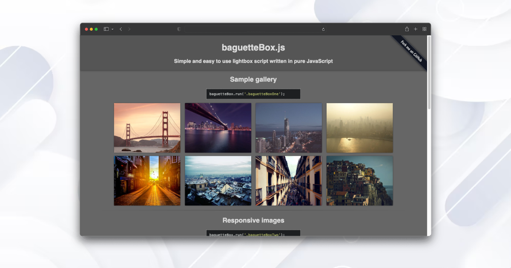
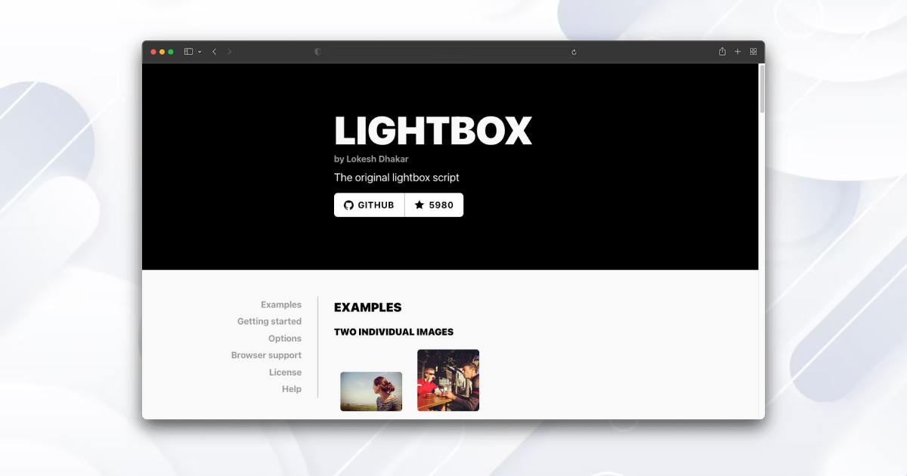
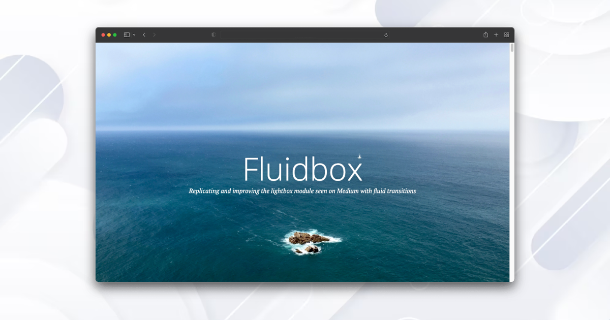

Using the right JavaScript gallery is key to making your website's photos and videos look amazing.
It's not just about looks; it's about making your website more engaging.

There are so many options to choose from, and it can be hard to know which one is best.
That's why we've carefully chosen the top 6 JavaScript libraries for 2024. These are perfect for making your site interactive and interesting.

No matter if you're an expert or new to web design, these libraries will fit all kinds of needs. Join us as we explore these top choices and help you upgrade your website this year!

### PhotoSwipe

<figure class="blog-images" data-src="photoswipe.png" data-lg-size="1200-630" >
    
</figure>

<a href="https://photoswipe.com/" rel="nofollow">PhotoSwipe</a> is a standalone JavaScript library for creating responsive image galleries with a focus on mobile devices. It offers a touch-friendly user interface, smooth transitions, and support for gestures like pinch-to-zoom. Widely used for its simplicity and flexibility, PhotoSwipe enhances the user experience by providing an elegant solution for showcasing images in a lightbox format.

**Pros**

- Responsive - works with any screen size

- Faster loading time for web pages

- It provides smooth touch interactions and supports gestures, making it ideal for mobile users who can swipe through images or pinch to zoom.

- It offers a range of customization options, allowing you to adapt the appearance and behavior of the image gallery to fit your specific needs.

**Cons**

- Not designed to display very large images

- Learning curve: complex  in understanding and implementation

- Compared to other website it does not have video support,there may be issues when using iframe

- If your project requires a highly customized and complex user interface for image galleries, you might find that PhotoSwipe has limitation

### BaguetteBox.js

<figure class="blog-images" data-src="baguettebox.png" data-lg-size="1200-630">
    
</figure>

<a href="https://feimosi.github.io/baguetteBox.js/" rel="nofollow">BaguetteBox.js</a> is a lightweight and straightforward JavaScript library designed for creating responsive image galleries with a clean and intuitive interface. With a focus on simplicity and performance, it allows developers to easily implement lightbox functionality for a seamless image viewing experience. BaguetteBox.js supports touch gestures, keyboard navigation, and auto-resizing, making it an efficient choice for integrating stylish and functional image galleries into web projects.

**Pros**

- It's relatively easy to use and set up

- Has minimal dependencies, which can be an advantage if you want a standalone solution without relying on other libraries

- BaguetteBox.js is mobile-friendly, so you can use it to display images on touch-screen devices. You can navigate through the gallery images with arrows navigation or swipe gestures

- Responsive - works with any screen size

**Cons**

- BaguetteBox.js is primarily designed for images, and it may have limited support for handling other multimedia types, such as videos or iframes.

- It may lack some advanced features present in other, more feature-rich libraries.

- No Thumbnail Support

- BaguetteBox.js may not have built-in support for lazy loading, which could impact the initial page load times, especially on pages with numerous large images.

### GLightbox

<figure class="blog-images" data-src="g-lightbox.png" data-lg-size="1200-630">
    
</figure>

<a href="https://biati-digital.github.io/glightbox/" rel="nofollow">GLightbox</a> is a modern and versatile JavaScript library for creating lightweight and customizable lightboxes to showcase images and videos. With a straightforward API, it enables developers to easily implement responsive galleries with features like zooming, fullscreen mode, and keyboard navigation. GLightbox stands out for its mobile-friendly design and seamless integration, offering a user-friendly solution for enhancing visual content presentations on the web.

**Pros**

- Responsive - works with any screen size

- Video Support - Youtube, Vimeo and self hosted videos with autoplay

- Support for mobile touch events like swipe, move, pinch, etc.

- GLightbox is relatively lightweight, contributing to faster loading times for web pages.

**Cons**

- Learning Curve: While GLightbox is designed to be easy to use, there might still be a learning curve for developers who are new to the library or those who have specific customization needs.

- License Restrictions: GLightbox, like many other JavaScript libraries, is likely to have a specific license agreement. It's crucial to review and understand the terms of the license to ensure compliance with your project's requirements.

- Performance Impact: Some lightbox plugins can affect page loading times and overall performance, especially if they load large media files or if there are compatibility issues.

- Complexity for Non-Technical Users: Configuring and customizing certain lightbox plugins might be challenging for users who are not familiar with web development or coding.

### Blueimp Gallery

<figure class="blog-images" data-src="blueimp.png" data-lg-size="1200-630">
    
</figure>

<a href="https://blueimp.github.io/Gallery/" rel="nofollow">Blueimp Gallery</a> is a powerful and flexible image and video gallery solution built with JavaScript. It provides a feature-rich environment for showcasing media content in a responsive and touch-friendly manner, supporting various transition effects and customization options. With its focus on accessibility and cross-browser compatibility, Blueimp Gallery is a reliable choice for developers seeking an efficient solution to create engaging and visually appealing galleries on the web.

**Pros**

- The blueimp Gallery offers a comprehensive set of features, including support for images, videos, carousels, and various customization options. It's suitable for a wide range of multimedia gallery needs.

- It provides smooth touch interactions and supports gestures, making it ideal for mobile users who can swipe through images or perform pinch-to-zoom actions.

- It includes built-in support for thumbnails, allowing for more complex gallery layouts with previews.

- Dynamic Loading: blueimp Gallery supports dynamic loading, enabling you to load images on demand rather than preloading all images at once. This can contribute to faster initial page loads.

**Cons**

- While blueimp Gallery is feature-rich, its extensive capabilities may make it more complex than needed for simpler projects. Developers may find it overkill for basic use cases.

- Potentially Heavier Initial Load: The library's comprehensive features may result in a heavier initial load compared to more lightweight alternatives

- Learning Curve for Advanced Features: Advanced features and customization options might be more challenging to implement, requiring a deeper understanding of the library's documentation.

- Performance Impact: Depending on the size and number of images or videos, there could be
Performance impact

### Lightbox2

<figure class="blog-images" data-src="lightbox.png" data-lg-size="1200-630">
    
</figure>

<a href="https://lokeshdhakar.com/projects/lightbox2/" rel="nofollow">Lightbox 2</a> is a popular and easy-to-use JavaScript library for creating modal image galleries with a simple and elegant interface. With a focus on user experience, it allows developers to implement responsive lightboxes that smoothly display images while overlaying the rest of the page. Lightbox2 is widely adopted for its versatility and customization options, making it a reliable choice for enhancing image presentations on websites.

**Pros**

- Lightbox2 is known for its simplicity and ease of use. It is straightforward to implement, making it accessible for developers with varying levels of experience.

- Responsive Design: Many lightbox scripts, including Lightbox2, are designed to be responsive, ensuring a consistent user experience across various devices and screen sizes.

- Lightweight: Lightbox scripts are typically lightweight, contributing to faster page loading times compared to loading separate pages for each image.

- Easy Integration: Lightbox2 is generally easy to integrate into websites, and it often requires minimal coding to set up.

**Cons**

- Customization Challenges: Customizing the appearance and behavior may require a deeper understanding of the script's code, which could be a challenge for less experienced developers.

- Performance Impact: Depending on the number and size of images, using a lightbox script might impact page load times.

- Lack of Advanced Transition Effects: Some users may find that lightbox scripts lack advanced transition effects compared to more feature-rich solutions.

- No Built-in Social Sharing: Some users might miss built-in social sharing features that are common in more comprehensive gallery solutions.

### Fluidbox

<figure class="blog-images" data-src="fluidbox.png" data-lg-size="1200-630">
    
</figure>

<a href="http://terrymun.github.io/Fluidbox/demo/index.html" rel="nofollow">Fluidbox</a> is a lightweight jQuery plugin designed for creating responsive and fluid lightboxes to display images. With its smooth animations and dynamic resizing, Fluidbox enhances the user experience by providing an elegant way to zoom in on images while maintaining a seamless transition. Its simplicity and compatibility make Fluidbox a user-friendly choice for implementing stylish lightbox functionality in web projects.

**Pros**

- The plugin is relatively lightweight, contributing to faster loading times for web pages.

- Minimalist Design: Fluidbox has a minimalist design, providing a clean and unobtrusive interface that focuses on showcasing the images.

- Fluidbox supports dynamic loading, allowing you to load images on demand rather than preloading all images at once

- Fluidbox is designed to be responsive, ensuring that the lightbox adapts well to different screen sizes and devices.

**Cons**

- The theming options in Fluidbox may be more limited compared to other lightbox. Developers seeking highly customized designs may find this limiting.

- Fluidbox is primarily designed for images, and it may lack built-in support for videos or other media types. If your project requires broader multimedia support, you might need additional customization.

- Performance Impact: Lightbox plugins can sometimes impact the overall performance of a webpage, particularly if large media files are involved.

- Documentation Quality: The quality of documentation can vary among plugins. If Fluidbox lacks comprehensive documentation, it may be challenging for users to implement and customize it effectively.

### Conclusion

There are types of JavaScript lightbox websites available for users to perform several types of functions and do image customisation on their website for modified and enhanced look. This article has featured some of the most popular and highly used JavaScript lightbox tools. These tools are supportable to all types of devices and feature some of the greatest image customisation characteristics.
